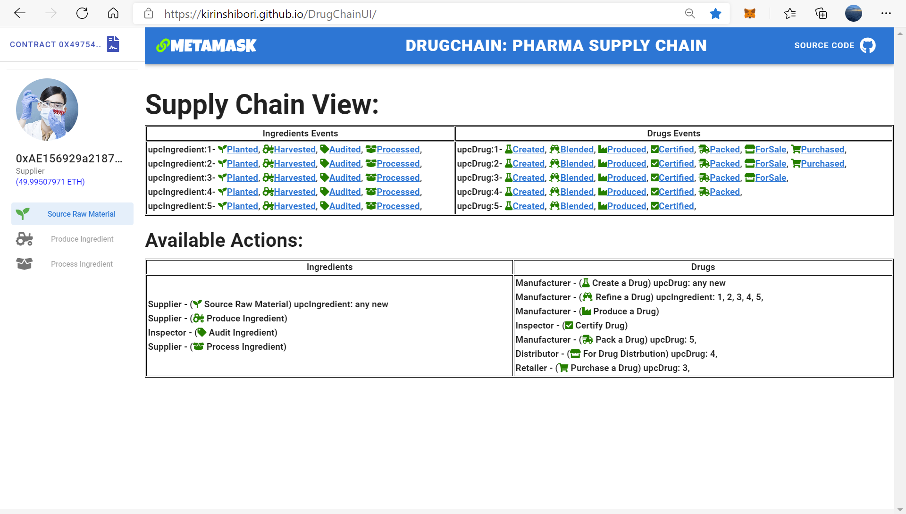

- [BCI Project: Ethereum Dapp for Tracking Ingredient and Drug through Supply Chain]
	- [Part 1: Plan the project with write-ups](#part-1-plan-the-project-with-write-ups)
		- [1.1 Project write-up - UML](#11-project-write-up---uml)
		- [1.2 Project write-up - Libraries](#12-project-write-up---libraries)
		- [1.3 Project write-up - IPFS](#13-project-write-up---ipfs)
		- [1.4 General Write Up](#14-general-write-up)
	- [Part 2: Write smart contracts](#part-2-write-smart-contracts)
	- [Part 3: Test smart contract code coverage](#part-3-test-smart-contract-code-coverage)
	- [Part 4: Deploy smart contracts on a public test network (Rinkeby)](#part-4-deploy-smart-contracts-on-a-public-test-network-rinkeby)
	- [Part 5: Modify client code to interact with smart contracts](#part-5-modify-client-code-to-interact-with-smart-contracts)
- [Frontend](#frontend)
	- [Frontend Online - Vue](#frontend-online---vue)
	- [Optional: Implement Infura to store product image](#optional-implement-infura-to-store-product-image)
- [INSTALL STEPS](#install-steps)

## Part 1: Plan the project with write-ups

### 1.1 Project write-up - UML

Definitions:

Choosen supply chain: Drug

| UML entity  | Details |
|:-------:|:--------|
| Asset | Ingredient,<br>Drug |
| Attributes | Ingredient:<br>- Current location<br>- Ownership<br>- Quantity available (kg)<br>- Geographical origin<br>- Date of production<br>- Ingredient notes<br>- Authenticity Third-party certifying body: FDA, HSA, etc<br><br>Drug:<br>- SKU<br>- Pack: units<br>- Location<br>- Ownership<br>- Drug name<br>- Active ingredients<br>- - Country of manufacture<br>- Manufacturer<br>- Date of manufacture<br>- Date of expiry<br>- Authenticity Third-party certifying body: FDA, HSA, etc<br> |
| Business Actions | Sourcing<br>Authenticity Certifying<br>Production<br>Distribution<br> |
| Role Permissions | Supplier<br>Inspector<br>Manufacturer<br>Distributor<br>Retailer |

Project write-up include the following UML diagrams:

| Diagram   | Details |  Status |
|:-------:|:--------|:--------:|
| Activity |    | :ok_hand: |
| Sequence |    | :ok_hand: |
| State    |    | :ok_hand: |
| Classes<br>(Data Model) |    | :ok_hand: |

### 1.2 Project write-up - Libraries

If libraries are used, the project write-up discusses why these libraries were adopted.

| Libraries | Details |  Status |
|:-------:|:--------|:--------:|
| none |  none libraries are used | :ok_hand: |

### 1.3 Project write-up - IPFS

If IPFS is used, the project write-up discusses how IPFS is used in this project.

| IPFS | Details |  Status |
|:-------:|:--------|:--------:|
| none |  IPFS are not used | :ok_hand: |


### 1.4 General Write Up

A general write up exists to items like steps and contracts address.

| Item | Value | Details |  Status |
|:-------:|:-------:|:--------|:--------:|
| Smart Contract Address |   |  smart contract address in Rinkeby network | :ok_hand: |
| Supplier Address |   |  address in Rinkeby network | :ok_hand: |
| Manufacturer Address |   |  address in Rinkeby network | :ok_hand: |
| Inspector Address |   |  address in Rinkeby network | :ok_hand: |
| Distributor Address |   |  address in Rinkeby network | :ok_hand: |
| Retailer Address |   |  address in Rinkeby network | :ok_hand: |

## Part 2: Write smart contracts

Write smart contracts with functions

CRITERIA


| CRITERIA   | MEETS SPECIFICATIONS |  Status |
|:-------|:--------|:--------:|
| SupplyChain.sol contains required tracking functions. | Smart contract implements functions to track.<br>For example:<br>- Product ID<br>- Product UPC<br>- Origination Information<br>- Supplier<br>- Misc organization info<br>- Longitude & Latitude of geo coordinates<br>- Product notes  | :ok_hand: |
| Ownable.sol contains required functions that establish owner and the transfer of ownership. | Ownable.sol has required functions that establish owner and the transfer of ownership.  | :ok_hand: |
| ConsumerRole.sol contains required functions that manage the Retailer role. | ConsumerRole.sol has required functions that manage the Retailer role.  | :ok_hand: |
| ProducerRole.sol contains required functions that manage the Manufacturer role. | ProducerRole.sol has required functions that manage the Manufacturer role.  | :ok_hand: |
| DistributorRole.sol contains required functions that manage the Distributor role. | DistributorRole.sol has required functions that manage the Distributor role.  | :ok_hand: |
| Additional roles implemented are integrated correctly. | Student has implemented additional roles correctly.  | :ok_hand: |

## Part 3: Test smart contract code coverage

| CRITERIA   | MEETS SPECIFICATIONS |  Status |
|:-------|:--------|:--------:|
| Test smart contract tests all required functions. | Project contains tests for the boiler plate functions and all tests are approved without error.  | :ok_hand: |

- Close all **ganache** instances on port 9545.
- Run **truffle** (on port 9545) with the following command:

```bash
  trufle develop
  
  # Compile
  truffle(develop)> compile
  
  # Test
  truffle(develop)> test
```

Please check the detailed setup instructions in the [link](../appvue/).


## Part 4: Deploy smart contracts on a public test network (Rinkeby)

| CRITERIA   | MEETS SPECIFICATIONS |  Status |
|:-------|:--------|:--------:|
| Deploy smart contract on a public test network. | a) Smart contract is deployed on on the Ethereum RINKEBY test network.<br>b) Project submission includes transaction ID and contract address.<br>c) Project submission includes a document (.md, .txt) that includes:<br>- Transaction ID<br>- Contract address | :ok_hand: |

## Part 5: Modify client code to interact with smart contracts

Modify client code to interact with a smart contract

| CRITERIA   | MEETS SPECIFICATIONS |  Status |
|:-------|:--------|:--------:|
| Client code interacts with smart contract. | Front-end is configured to:<br>- Submit a product for shipment (supplier to the manufacturer, manufacturer to distributor, etc).<br>- Receive product from shipment.<br>- Validate the authenticity of the product. | :ok_hand: |

# Frontend

## Frontend Online - Vue

Following there is a online version of Fronted deployed in GitHub pages:
[https://kirinshibori.github.io/DrugChainUI/](https://kirinshibori.github.io/DrugChainUI/).

## Frontend screenshots


<<<<<<< Updated upstream

=======
>>>>>>> Stashed changes

## Optional: Implement Infura to store product image

Optional: Implement Infura to store product image

<<<<<<< Updated upstream
Ex: Manufacturer uploads Drug pics w/ UPC hash
=======
Ex: Drug pics w/ UPC hash
>>>>>>> Stashed changes
Potentially only 2 methods needed upload() and read()


# INSTALL STEPS

Follow the instructions:
1. Smart Contract build, test and deployment: [contract link](./contracts/).
2. Front End build and run in localhost server: [appVue link](./appvue/).# DrugChain
