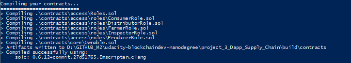
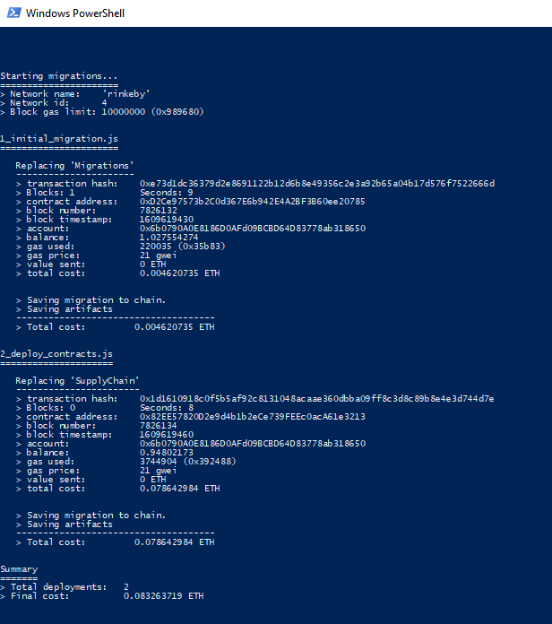
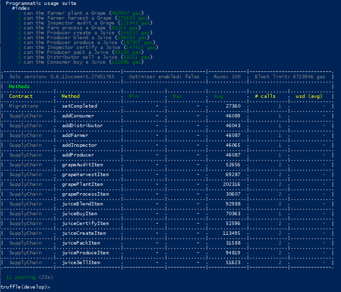
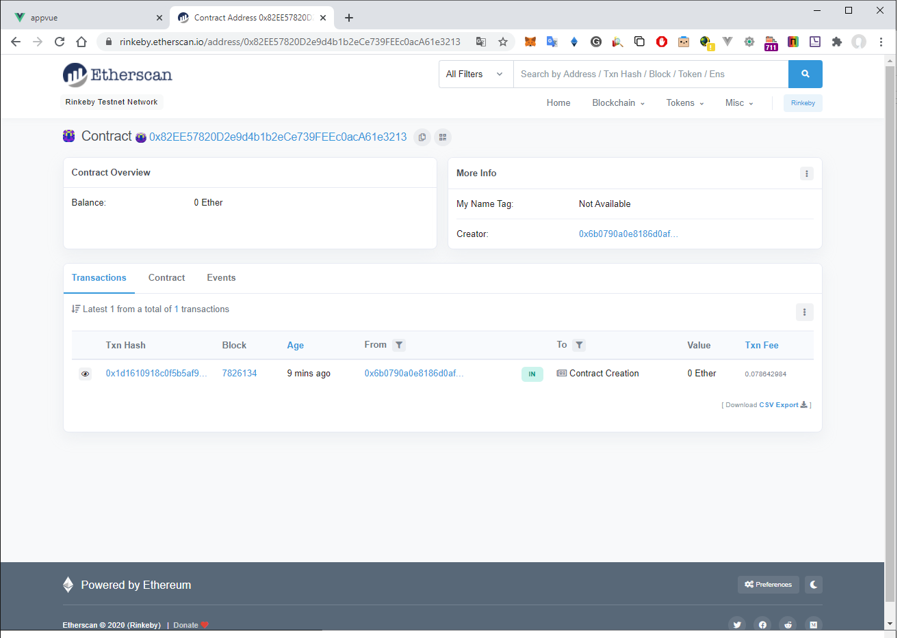
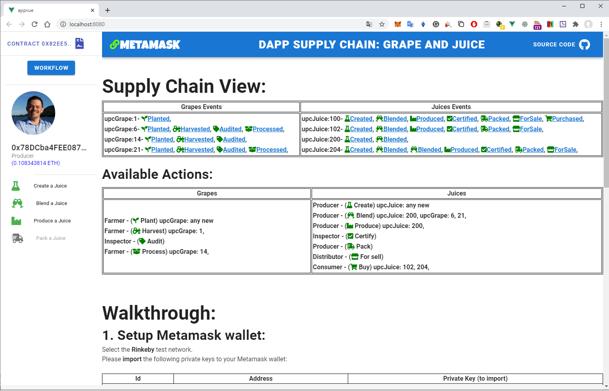

- [Smart Contract - step by step](#smart-contract---step-by-step)
	- [Versions](#versions)
	- [Steps to Install the Environment](#steps-to-install-the-environment)
		- [Node.js](#nodejs)
		- [Truffle and other packets](#truffle-and-other-packets)
	- [To compile and run tests](#to-compile-and-run-tests)
- [Deployment](#deployment)
	- [Ganache](#ganache)
	- [Get some funds](#get-some-funds)
	- [To deploy in Brinkeby](#to-deploy-in-brinkeby)
		- [Deployment Terminal Output](#deployment-terminal-output)
		- [Contract Address](#contract-address)
		- [Transaction Hashes](#transaction-hashes)
		- [Etherscan screenshots](#etherscan-screenshots)
- [Frontend](#frontend)
	- [Frontend Online - Vue](#frontend-online---vue))
	- [Frontend screenshots](#frontend-screenshots)

# Smart Contract - step by step

## Versions

Run `truffle version` command:

| Package   | Version |
|:-------:|:-------------|
|Truffle| v5.1.58 (core: 5.1.58) |
|Solidity| 0.6.12 (solc-js) |
|Node| v14.15.1 |
|Web3.js| v1.2.9 |

As configured in truffle-config.js the smart contracts was compiled successfully using:

- solc: 0.6.12

## Steps to Install the Environment

### Node.js

Install a clean version of nodejs. I´m using the nvm (Node Version Manager) tool to allow install and switch between versions. Currently the version 14 of node.js works:

```bash
nvm install 14.15.1
nvm use 14.15.1
```

### Truffle and other packets

install truffle, openzelepin, webpack and dependences:

```bash
cd DrugChainDAPP\
npm i -g truffle
npm i --save openzeppelin-solidity
npm i --save truffle-hdwallet-provider
npm i --save-dev eth-gas-reporter
npm i truffle-assertions
npm i -g webpack
npm i -g webpack-dev-server webpack-cli webpack-dev-middleware webpack-hot-middleware copy-webpack-plugin
```

## To compile and run tests

For starting the development console, run:

```bash
truffle develop
```

For compiling the contract, inside the development console, run:

```bash
compile
```


For migrating the contract to the locally running Ethereum network, inside the development console, run:

```bash
migrate --reset
```


For running unit tests the contract, inside the development console, run:

```bash
test
```



# Deployment

## Ganache
```bash
npm install -g ganache-cli
```

create a file called ./secret.txt with your mnemonics of your wallet, like:

```txt
skin impose this task range body amused apple spin jazz inhale bench
```

edit line 24 of ./truffle-config.js and replace with your Infura Key:

```js
24:   const infuraKey = "c216...";	// INFURA - PROJECT ID
```

## Get some funds
First send some funds to your account. Use Ganache to get the addess of the first account from your secrets.txt mnemonic.
Go to https://faucet.rinkeby.io/ and send a tweet as instructions. Copy-paste your tweet url and have fun!


## To deploy in Rinkeby

Then, execute the command:

```bash
truffle migrate --network rinkeby --reset
```

### Deployment Terminal Output

```bash
.\DrugChainDAPP> truffle migrate --network rinkeby --reset

Compiling your contracts...
===========================
> Compiling .\contracts\access\Roles.sol
> Compiling .\contracts\access\roles\ConsumerRole.sol
> Compiling .\contracts\access\roles\DistributorRole.sol
> Compiling .\contracts\access\roles\FarmerRole.sol
> Compiling .\contracts\access\roles\InspectorRole.sol
> Compiling .\contracts\access\roles\ProducerRole.sol
> Compiling .\contracts\core\Ownable.sol
> Artifacts written to .\DrugChainDAPP\build\contracts
> Compiled successfully using:
   - solc: 0.6.12+commit.27d51765.Emscripten.clang


1_initial_migration.js
======================

   Deploying 'Migrations'
   ----------------------
   > transaction hash:    0xd26ceda3eb7e7fe27734f2395497bd3a3a4daf14151e8df444119628412613b9
   > Blocks: 2            Seconds: 17
   > contract address:    0x16F1eb70865083bc9EBbf2165dF564A7612Ea95b
   > block number:        8237213
   > block timestamp:     1615791363
   > account:             0x0BC85Ee983E7098Ceb32a775B81299f047d54e8b
   > balance:             137.899088239
   > gas used:            220035 (0x35b83)
   > gas price:           21 gwei
   > value sent:          0 ETH
   > total cost:          0.004620735 ETH


   > Saving migration to chain.
   > Saving artifacts
   -------------------------------------
   > Total cost:         0.004620735 ETH


2_deploy_contracts.js
=====================

   Deploying 'SupplyChain'
   -----------------------
   > transaction hash:    0x5f0d33c52f9b45d9bdbdfb10f1ca7326e1921d66e418e42064fd7a6fe798d810
   > Blocks: 1            Seconds: 9
   > contract address:    0x4DF57E0D3Fdd839223445A965c77F1FE3E1b5A24
   > block number:        8237215
   > block timestamp:     1615791393
   > account:             0x0BC85Ee983E7098Ceb32a775B81299f047d54e8b
   > balance:             137.819555443
   > gas used:            3744916 (0x392494)
   > gas price:           21 gwei
   > value sent:          0 ETH
   > total cost:          0.078643236 ETH


   > Saving migration to chain.
   > Saving artifacts
   -------------------------------------
   > Total cost:         0.078643236 ETH


Summary
=======
> Total deployments:   2
> Final cost:          0.083263971 ETH


```

### Contract Address

contract address:    0x4DF57E0D3Fdd839223445A965c77F1FE3E1b5A24

<https://rinkeby.etherscan.io/address/0x4DF57E0D3Fdd839223445A965c77F1FE3E1b5A24>

### Transaction Hashes

deployment transaction hash:   <https://rinkeby.etherscan.io/tx/0x1d1610918c0f5b5af92c8131048acaae360dbba09ff8c3d8c89b8e4e3d744d7e>


### Etherscan screenshots

<https://rinkeby.etherscan.io/address/0x82EE57820D2e9d4b1b2eCe739FEEc0acA61e3213>



# Frontend

For running the Front End of the DAPP, open another terminal window and go inside the project directory, and run:

```bash
cd appvue
```

Then follow the instruction in [link](../appvue/)


## Frontend Online - Vue

Following there is a online version of Fronted deployed in GitHub pages:
[https://kirinshibori.github.io/DrugChainUI/](https://kirinshibori.github.io/DrugChainUI/).


## Frontend screenshots

